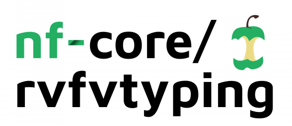

<!-- #  -->

<!-- **Identify Rift Valley Fever virus lineages of a nucleotide sequence**. -->

- [Introduction](#introduction)
  - [Installation](#installation)
  - [Testing](#test)
  - [Usage](#usage)
  - [Method details](#method-details)
  - [Output](#output)
  - [Pipeline summary](#pipeline-summary)
  - [Citations](#citations)
  

[](https://www.nextflow.io/)
[](https://bioconda.github.io/)
[](https://nfcore.slack.com/channels/rvfvtyping)
[](https://github.com/ajodeh-juma/rvfvtyping/blob/master/LICENSE)
<!-- [](https://hub.docker.com/r/nfcore/rvfvtyping) -->
<!-- [](https://github.com/nf-core/rvfvtyping/actions) -->
<!-- [](https://github.com/nf-core/rvfvtyping/actions) -->
<!--  -->

[](https://twitter.com/john_juma)

## Introduction

**rvfvtyping** is a bioinformatics analysis pipeline for classification and phylogenetic lineage assignment of Rift Valley fever virus consensus genomes using the glycoprotein Gn/G2 gene found within the M-segment of the virus genome.

Classifying query sequences involves two steps. The first step is the identification of the virus species and the second is the assignment of Rift Valley fever virus lineages through phylogenetic analysis. Classification of query sequences is performed using ```diamond``` while phylogenetic assignment uses ```iqtree```, and is largely adopted from the initial [pangolin](https://github.com/cov-lineages/pangolin) method developed by [Áine O'Toole](https://github.com/aineniamh).


The pipeline is built using [Nextflow](https://www.nextflow.io), a workflow tool to run tasks across multiple compute infrastructures in a very portable manner. It comes with docker containers making installation trivial and results highly reproducible.

A web application of the pipeline is hosted on a dedicated server at the University of KwaZulu Natal and can be found [here](http://krisp.ukzn.ac.za/app/typingtool/rvfv/)

## Installation

**rvfvtyping** runs on UNIX/LINUX systems. You will install Miniconda3 from [here](https://docs.conda.io/en/latest/miniconda.html). Once Miniconda3 has been installed, proceed with pipeline installation

```
git clone https://github.com/ajodeh-juma/rvfvtyping.git
cd rvfvtyping
conda env create -n rvfvtyping-env -f environment.yml
conda activate rvfvtyping-env
```

## Testing

  - Optional: Test the installation on a single FASTA 
    
    ```nextflow run main.nf -profile test```
    
  - Optional: Test the installation on several FASTA sequence files
    
    ```nextflow run main.nf -profile test_full```

## Usage

For minimal pipeline options, use the ```--help``` flag e.g. 

```nextflow run main.nf --help```

To see all the options, use the ```--show_hidden_params``` flag e.g.

```nextflow run main.nf --help --show_hidden_params```

A typical command
```
nextflow run main.nf \
   --input 'data/test/*.fa' \
   --outdir output-dir \
   -work-dir work-dir \
```

## Method details

The pipeline offers several parameters including as highlighted:

```
Input/output options
  --input                      [string]  Input Fasta file for typing
  --guide_tree                 [string]  specifies which guide tree to apply for phylogenetic inference, options ['ml-snps', 'ml-bayes'] [default: 
                                         ml-bayes] 
  --outdir                     [string]  The output directory where the results will be saved. [default: ./results]
  --email                      [string]  Email address for completion summary.

Diamond options
  --skip_diamond               [boolean] Skip all DIAMOND BLAST against the pre-configured database.

```
### mandatory parameters
|__parameter__ |__description__ |__type__ |
| --- | --- | --- |
|`--input`|Input Fasta file(s) format `.fa` or `.fasta` for typing .| ```string``` |

## Output

Several output files will be generated including a comma-separated values file (```lineages.csv```) will be a csv file with taxon name and lineage assigned for each input query sequence per line

e.g.


| Query | Lineage   | aLRT | UFbootstrap | Length | Ns(%) | Note | Year_first | Year_last | Countries |
| ----------- |:---------:|:----------:|:----------:|:----------:|:----------:|:----------:|:----------:|:----------:|:----------: |
| DQ380218|G|84|70|3885|0.00|assigned (bootstrap value >= 70)|1969|1993|Senegal;CAR;Zimbabwe;Guinea|
| HM587118|L|99|100|490|0.00|assigned (bootstrap value >= 70)|1963|1995|Zimbabwe;Egypt;South Africa;Kenya|
| DQ380221|D|92|98|3885|0.00|assigned (bootstrap value >= 70)|1973|1973|CAR|
| DQ380222|J|77|27|3885|0.00|unassigned (bootstrap value < 70)||||
| HM587045|B|89|97|490|0.00|assigned (bootstrap value >= 70)|1972|1972|Kenya|
| DQ380189|L|99|100|3885|0.00|assigned (bootstrap value >= 70)|1963|1995|Zimbabwe;Egypt;South Africa;Kenya|
| HM587125|O|92|98|490|0.00|assigned (bootstrap value >= 70)|1951|1951|South Africa|
| HM587108|I|87|90|490|0.00|assigned (bootstrap value >= 70)|1955|1956|South Africa|
| MG972973|C|88|96|3852|0.00|assigned (bootstrap value >= 70)|1976|2016|South Africa;Somalia;Uganda;Angola;Madagascar;Sudan;Zimbabwe;Mauritania;Saudi Arabia;Kenya|
| AF134496|N|88|84|738|0.00|assigned (bootstrap value >= 70)|1975|1993|Senegal;Mauritania;Burkina Faso|
| EU574086.1|J|74|33|1690|0.00|unassigned (bootstrap value < 70)||||
| RVFV_Namibia_2011_MT561463_NAM_2011|C|89|95|3830|0.00|assigned (bootstrap value >= 70)|1976|2016|South Africa;Somalia;Uganda;Angola;Madagascar;Sudan;Zimbabwe;Mauritania;Saudi Arabia;Kenya|

If ```--skip_diamond``` is not used, the classification file ```diamond_results.csv``` is not  generated

| QueryID | Length   | SubjectID | Segment | Product | PercentIdentity | Mismatches | Gaps |
| ----------- |:---------:|:----------:|:----------:|:----------:|:----------:|:----------:|:----------:|
| HM587118 | 489 | YP_003848705.1 |M|glycoprotein|100|0|0|
|MG972973|3591|YP_003848705.1|M|glycoprotein|99.3|8|0|
|DQ380221|3591|YP_003848705.1|M|glycoprotein|99|4|7|0|
|AF134496|738|YP_003848705.1|M|glycoprotein|98.8|3|0|
|DQ380222|3591|YP_003848705.1|M|glycoprotein|99.2|9|0|
|EU574086.1|795|YP_003848706.1|S|non-structural protein|97.4|7|0|
|EU574086.1|735|YP_003848707.1|S|nucleocapsid|99.6|1|0|
|RVFV_Namibia_2011_MT561463_NAM_2011|3558|YP_003848705.1|M|glycoprotein|99.2|9|0|
|DQ380218|3591|YP_003848705.1|M|glycoprotein|99.5|6|0|
|HM587108|489|YP_003848705.1|M|glycoprotein|100|0|0|
|DQ380189|3591|YP_003848705.1|M|glycoprotein|98.9|13|0|
|HM587125|489|YP_003848705.1|M|glycoprotein|99.4|1|0|
|HM587045|489|YP_003848705.1|M|glycoprotein|100|0|0|

 


## Pipeline Summary

By default, the pipeline currently performs the following:

<!-- TODO nf-core: Fill in short bullet-pointed list of default steps of pipeline -->

* Classification of query sequence(s) (`diamond`)
* Phylogenetic typing (`iqtree`)

<!-- ## Documentation -->

<!-- The nf-core/rvfvtyping pipeline comes with documentation about the pipeline: [usage](https://nf-co.re/rvfvtyping/usage) and [output](https://nf-co.re/rvfvtyping/output). -->

<!-- TODO nf-core: Add a brief overview of what the pipeline does and how it works -->

## Credits

**rvfvtyping** was originally written by [John Juma](https://www.ilri.org/people/john-juma).

We thank the following people for their extensive assistance in the development
of this pipeline:
- [Vagner Fonseca](https://za.linkedin.com/in/vagner-fonseca-72971a68)
- [Peter Van Heusden](http://repository.uwc.ac.za/xmlui/handle/10566/2163)

## License
rvfvtyping is free software, licensed under [GPLv3](https://github.com/ajodeh-juma/rvfvtyping/blob/master/LICENSE).

## Issues
Please report any issues to the [issues page](https://github.com/ajodeh-juma/rvfvtyping/issues).

## Contribute
If you wish to fix a bug or add new features to the software we welcome Pull Requests. We use
[GitHub Flow style development](https://guides.github.com/introduction/flow/). Please fork the repo, make the change, then submit a Pull Request against out master branch, with details about what the change is and what it fixes/adds. 
We will then review your changes and merge them, or provide feedback on enhancements.

## Citations

**rvfvtyping** pipeline uses the following software:
> 
> Buchfink, B., Xie, C., & Huson, D. H. (2015). Fast and sensitive protein alignment using DIAMOND. Nature Methods, 12(1), 59–60. https://doi.org/10.1038/nmeth.3176
>
>Guindon, S., & Gascuel, O. (2003). A simple, fast, and accurate algorithm to estimate large phylogenies by maximum likelihood. Systematic Biology, 52(5), 696–704. https://doi.org/10.1080/10635150390235520
>
>Hoang, D. T., Chernomor, O., von Haeseler, A., Minh, B. Q., & Vinh, L. S. (2018). UFBoot2: Improving the Ultrafast Bootstrap Approximation. Molecular Biology and Evolution, 35(2), 518–522. https://doi.org/10.1093/molbev/msx281
>
>Huelsenbeck, J. P., & Ronquist, F. (2001). MRBAYES: Bayesian inference of phylogenetic trees. Bioinformatics, 17(8), 754–755. https://doi.org/10.1093/bioinformatics/17.8.754
>
>Katoh, K. (2002). MAFFT: A novel method for rapid multiple sequence alignment based on fast Fourier transform. Nucleic Acids Research, 30(14), 3059–3066. https://doi.org/10.1093/nar/gkf436
>
>Larkin, M. A., Blackshields, G., Brown, N. P., Chenna, R., McGettigan, P. A., McWilliam, H., Valentin, F., Wallace, I. M., Wilm, A., Lopez, R., Thompson, J. D., Gibson, T. J., & Higgins, D. G. (2007). Clustal W and Clustal X version 2.0. Bioinformatics, 23(21), 2947–2948. https://doi.org/10.1093/bioinformatics/btm404
>
>Vilsker, M., Moosa, Y., Nooij, S., Fonseca, V., Ghysens, Y., Dumon, K., Pauwels, R., Alcantara, L. C., Vanden Eynden, E., Vandamme, A.-M., Deforche, K., & de Oliveira, T. (2019). Genome Detective: An automated system for virus identification from high-throughput sequencing data. Bioinformatics, 35(5), 871–873. https://doi.org/10.1093/bioinformatics/bty695
>
>Yu, G., Smith, D. K., Zhu, H., Guan, Y., & Lam, T. T.-Y. (2017). ggtree: An r package for visualization and annotation of phylogenetic trees with their covariates and other associated data. Methods in Ecology and Evolution, 8(1), 28–36. https://doi.org/10.1111/2041-210X.12628
>
>An imagemagick-like frontend to Biopython SeqIO [seqmagick](https://github.com/fhcrc/seqmagick/)